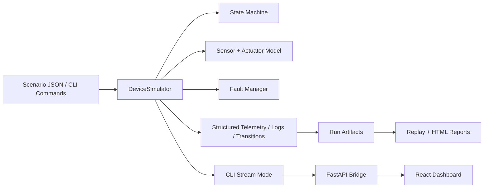

# DeviceLab Pro

DeviceLab Pro is an embedded device simulation lab built to show production-minded systems engineering, not just a toy state machine. The project combines a deterministic C++ simulator, scenario automation, replayable artifacts, typed Python tooling, and a premium monitoring dashboard that streams real simulator output.

## Why This Project Exists

- explicit embedded-style state machine with actuator and sensor behavior
- deterministic fault injection and replay-safe scenario execution
- structured telemetry, logs, transitions, and exportable reports
- typed bridge APIs and a polished dashboard that visualizes the real runtime
- build, test, Docker, and CI paths that are usable by another engineer without hand-holding

## Stack

- Core simulator: C++20
- Build system: CMake
- Tests: GoogleTest
- Tooling and bridge: Python 3.12 + FastAPI
- Dashboard: React 18 + TypeScript + Tailwind CSS + Recharts
- DevOps: Docker Compose + GitHub Actions

## Repository Layout

```text
.
├── apps/simulator_cli/        # CLI entry point and REPL
├── core/                      # simulator, state machine, validation, reporting
├── dashboard/                 # React monitoring UI
├── docs/                      # architecture and state machine documentation
├── profiles/                  # configurable device profiles
├── scenarios/                 # deterministic scenario definitions
├── tests/                     # GoogleTest suite
├── tools/bridge/              # FastAPI REST + WebSocket bridge
├── tools/reporting/           # report generation utilities
└── runs/                      # seeded demo artifacts and exported runs
```

## Architecture



Additional design notes:
- [Architecture](/Users/burrivamshikrishna/Desktop/DeviceLabPro/docs/architecture.md)
- [State Machine](/Users/burrivamshikrishna/Desktop/DeviceLabPro/docs/state-machine.md)

## Quick Start

### Native

```bash
cmake -S . -B build
cmake --build build
ctest --test-dir build --output-on-failure
```

You can also use the convenience targets:

```bash
make build
make test
make smoke
make bridge-test
make dashboard-build
```

### Docker Compose

```bash
docker compose up --build
```

This boots:
- FastAPI bridge on `http://localhost:8000`
- dashboard on `http://localhost:5173`

The compose stack now waits for the bridge health check before starting the dashboard, which makes first-run startup much less fragile.

## CLI

List available assets:

```bash
./build/devicelab_cli list
```

Run a scenario:

```bash
./build/devicelab_cli run \
  --scenario scenarios/nominal_behavior.json \
  --profile profiles/thermal_controller_mk1.json
```

If `--output-dir` is omitted, the CLI creates a timestamped directory under `runs/` automatically.

Replay an exported manifest:

```bash
./build/devicelab_cli replay \
  --manifest runs/nominal_behavior/replay_manifest.json
```

Stream live telemetry for the dashboard bridge:

```bash
./build/devicelab_cli stream \
  --scenario scenarios/degraded_behavior.json \
  --profile profiles/thermal_controller_mk1.json
```

Open the interactive shell:

```bash
./build/devicelab_cli interactive --profile profiles/thermal_controller_mk1.json
```

## Bridge And Dashboard

Install Python tooling dependencies:

```bash
python3 -m pip install -r tools/bridge/requirements-dev.txt
```

Run the bridge:

```bash
python3 -m uvicorn tools.bridge.server:app --host 0.0.0.0 --port 8000
```

The bridge exposes:
- `GET /api/health`
- `GET /api/overview`
- `GET /api/scenarios`
- `GET /api/profiles`
- `GET /api/history`
- `POST /api/runs/{scenario_id}`
- `WS /ws/telemetry`

Run the dashboard:

```bash
cd dashboard
npm ci
npm run dev
```

The dashboard validates API responses at runtime, handles loading/empty/error states explicitly, and consumes live WebSocket events from the bridge rather than seed-only mock data.

## Demo Scenarios

| Scenario | Focus | Expected Outcome |
| --- | --- | --- |
| `nominal_behavior.json` | startup, stable thermal loop, controlled shutdown | all assertions pass, clean artifact set |
| `degraded_behavior.json` | communication fault, degraded cooling envelope, recovery | degraded state, fault handling, eventual recovery |
| `failure_recovery.json` | overtemperature escalation, operator acknowledgement, recovery | safe fault response and deterministic replay digest |

## Reporting And Artifacts

Each run exports:

- `summary.json`
- `telemetry.jsonl`
- `logs.jsonl`
- `transitions.json`
- `replay_manifest.json`
- `report.md`
- `report.html`

Generate standalone HTML from a summary:

```bash
python3 tools/reporting/render_report.py runs/nominal_behavior/summary.json
```

Seeded demo runs are included in:
- `runs/nominal_behavior`
- `runs/degraded_behavior`
- `runs/failure_recovery`
- `runs/nominal_behavior_replay`

## Testing

Coverage includes:

- GoogleTest regression tests for simulator behavior and validation failures
- scenario smoke coverage through the CLI
- Python bridge API tests
- report rendering tests
- dashboard type-check and production build validation

Run the tooling tests directly:

```bash
python3 -m pytest tools -q
```

## Environment Notes

- `DEVICELAB_PROJECT_ROOT` can override bridge project-root discovery.
- `DEVICELAB_CLI_BIN` can point the bridge at a prebuilt simulator binary.
- The simulator is discrete-time and deterministic by design.
- Device profiles tune timing, control thresholds, watchdog behavior, and actuator outputs.

## CI

GitHub Actions runs:

- C++ configure, build, and test
- scenario smoke execution
- Python syntax validation and tooling tests
- dashboard production build
