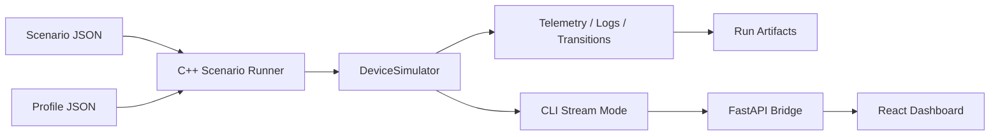

# Architecture

DeviceLab Pro is organized as a deterministic simulator core with thin orchestration and presentation layers around it.

## Layers

1. `core/`
   - `DeviceSimulator` owns the explicit state machine, control loop, actuator model, automatic fault evaluation, and telemetry snapshots.
   - `ScenarioDefinition` and `run_scenario()` drive scripted events and expectations against the same simulator API used by the CLI.
   - Artifact generation writes machine-readable traces (`summary.json`, `telemetry.jsonl`, `logs.jsonl`, `replay_manifest.json`) and a human-readable Markdown report.

2. `apps/simulator_cli/`
   - `run` executes scenarios and exports artifacts.
   - `replay` reruns from a captured replay manifest and verifies the digest.
   - `stream` replays a completed scenario as a line-delimited JSON event feed for the monitoring dashboard.
   - `interactive` offers a REPL for manual command, sensor, and fault control.

3. `tools/bridge/`
   - FastAPI bridge that spawns the CLI `stream` mode as a subprocess.
   - Exposes REST endpoints for metadata and run control.
   - Broadcasts live telemetry, logs, transitions, and summaries over WebSocket.

4. `dashboard/`
   - React + TypeScript + Tailwind monitoring UI.
   - Renders live state, telemetry charts, faults, transitions, and run history.
   - Uses the bridge as the only runtime backend contract.

## Data Flow

## Artifact Contract

- `summary.json`: overall pass/fail, digest, final state, assertions, transition list.
- `telemetry.jsonl`: one structured telemetry frame per tick.
- `logs.jsonl`: structured device and scenario log events.
- `transitions.json`: explicit state transition trail.
- `replay_manifest.json`: replayable scenario + profile snapshot plus expected digest.
- `report.md` / `report.html`: human-readable exported report.

## Determinism Notes

- Time is modeled as discrete ticks, not wall clock time.
- Scenario events are sorted and applied at exact ticks before simulation advance.
- Sensor noise uses a deterministic hash-based function seeded by scenario seed and tick.
- Replay correctness is verified by digesting telemetry, logs, and transitions into a stable run fingerprint.
