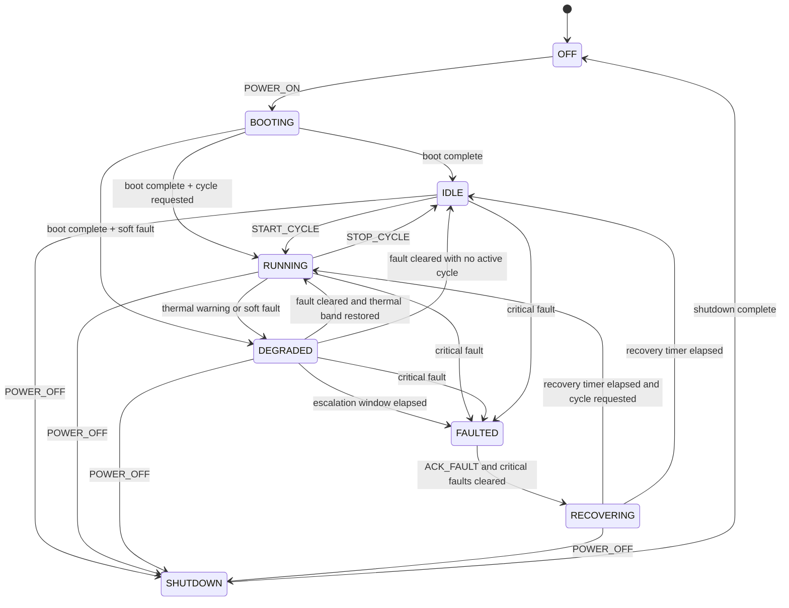

# State Machine

The simulator models a single embedded thermal controller with an explicit state machine and safe-state behavior.

## States

- `OFF`: unpowered, all actuators disabled.
- `BOOTING`: startup sequencing and sensor stabilization window.
- `IDLE`: ready state, no active processing cycle.
- `RUNNING`: nominal control loop with heater and pump regulation.
- `DEGRADED`: reduced-capability control caused by soft faults or thermal warning.
- `FAULTED`: latched safe state triggered by critical faults or prolonged degraded operation.
- `RECOVERING`: post-fault validation window before re-entering service.
- `SHUTDOWN`: controlled power-down before returning to `OFF`.

## Diagram

## Fault Handling

- `SENSOR_FAILURE`
  - Critical
  - Triggered by invalid sensor input
  - Drives immediate `FAULTED` transition

- `OVERHEATING`
  - Critical
  - Triggered by temperature at or above `critical_temperature_c`
  - Cleared automatically when temperature falls to `recovery_temperature_c`

- `COMMUNICATION_FAILURE`
  - Soft
  - Drives `DEGRADED`
  - Escalates to `FAULTED` if it persists through the degraded escalation window

- `TIMEOUT`
  - Soft
  - Triggered by heartbeat expiry while active processing is underway
  - Cleared when heartbeat traffic resumes

## Command Semantics

- `POWER_ON`: enters `BOOTING` from `OFF`.
- `START_CYCLE`: requests active processing and moves `IDLE` to `RUNNING` if safe.
- `STOP_CYCLE`: exits active processing and returns to `IDLE`.
- `ACK_FAULT`: releases `FAULTED` into `RECOVERING` only after critical faults are gone.
- `RESET`: clears latched faults, restores communications/sensor validity, and restarts boot.
- `HEARTBEAT`: refreshes the timeout watchdog window.
- `SET_TARGET_TEMPERATURE`: updates the operating setpoint within safe bounds.
